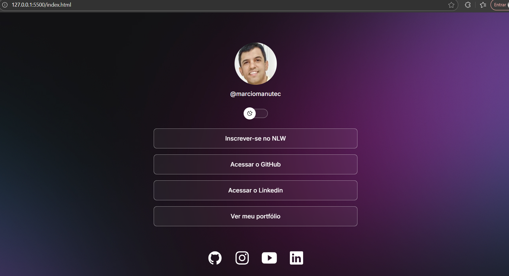

# P_Projeto

 Programa exclusivo e gratuito, provovido pela RocketSeat para ensino de tecnologias WEB. 

<a href="#-tecnologias">Tecnologias</a>&nbsp;&nbsp;&nbsp;&nbsp;&nbsp;&nbsp;
<a href="#-projeto">Projeto</a>&nbsp;&nbsp;&nbsp;&nbsp;&nbsp;&nbsp;

## Tecnologias

Esse projeto foi desenvolvido com as seguintes tecnologias:

- HTML e CSS
- JavaScript
- Git e Github
- Figma

## Projeto

O DevLinks é um agregador de links para usar como cartão de visitas online.
